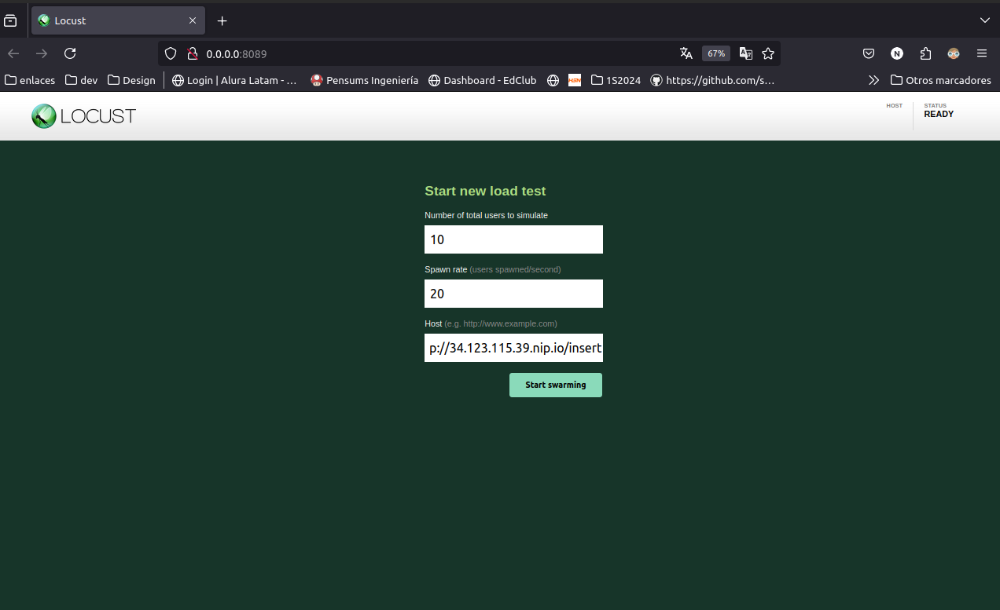
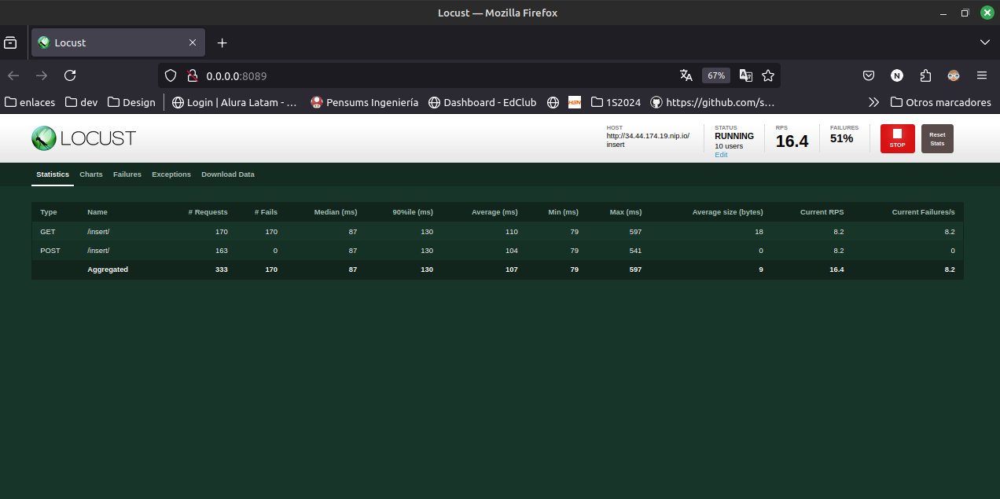
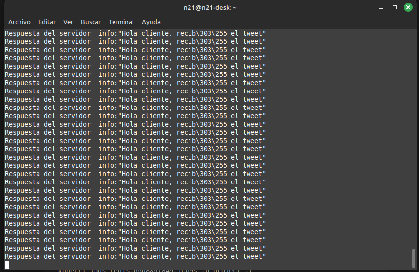
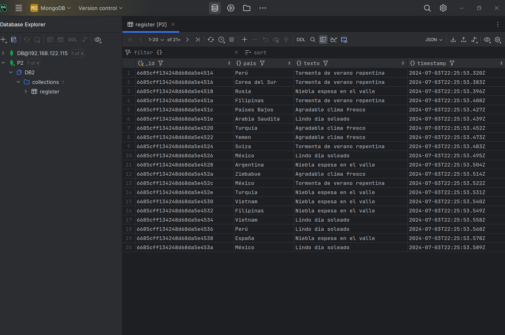
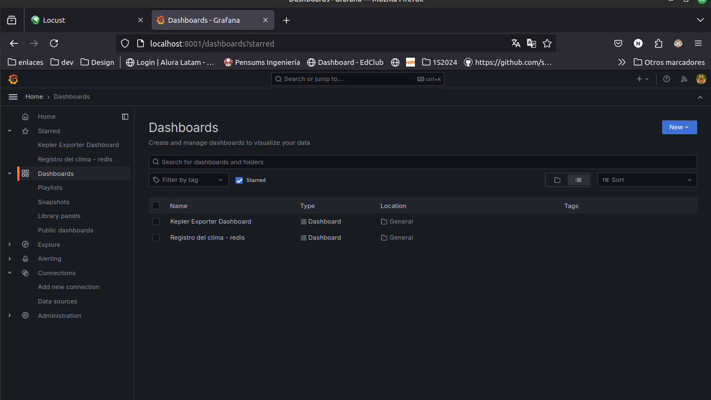
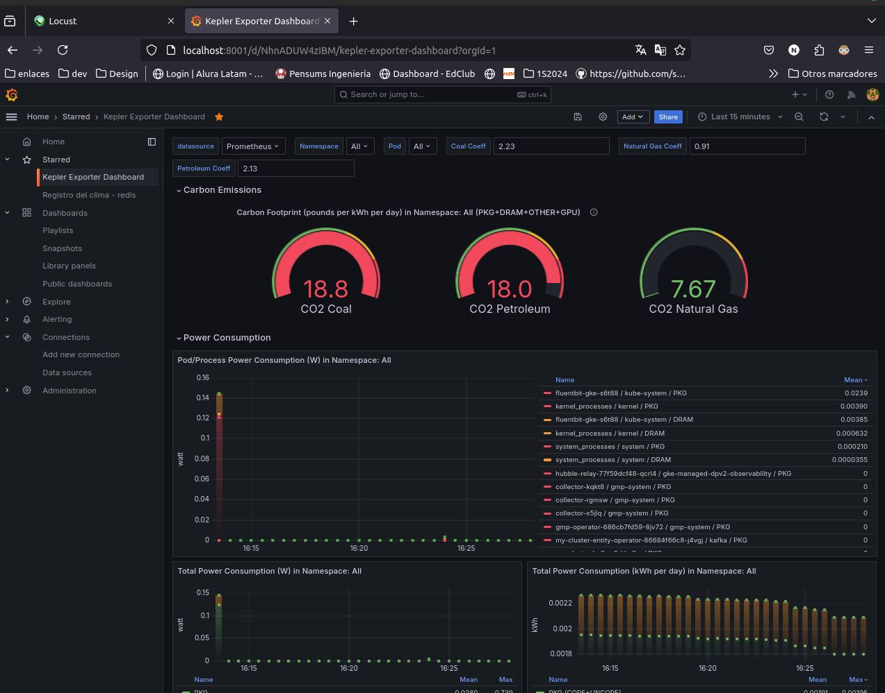
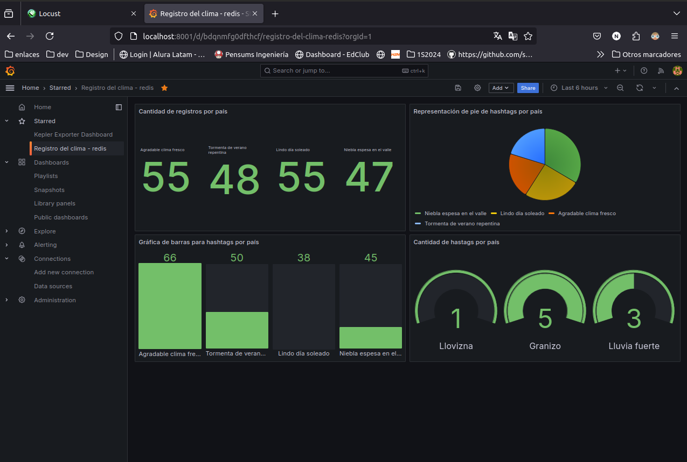

# MANUAL TÉCNICO - PROYECTO 2

## **INDICE**
  - [**RESPONSABLES**](#responsables)
  - [**EJECUCIÓN**](#ejecución)
  - [**DATA**](#data)
  - [**MONGODB**](#mongodb)
  - [**GRAFANA**](#grafana)
___
## **RESPONSABLES**

|No.| Nombre | Carnet |
|:-:| ------ | ------ |
|1| Geremías López | 200313184 |
|2| Nery Jiménez| 201700381 |

___
## **EJECUCIÓN**
Ingresamos a la carpeta donde tengamos nuestro archivo de Locus y lo ejecutamos con el siguiente comando:

```bash
# Entra al ambiente virtual
source env1/bin/activate

# Ejecutando
locust -f traffic.py
```

Nos mostrará la siguiente información:


En esta pestaña le especificamos cuántos usuarios estarán mandando los tweets y la cantidad por segundo, también se le especifica la ip de nuestro servicio ingress.

___
## **DATA**
Al iniciar la carga de datos, podremos ver la siguiente tabla donde nos indica cuántos request está realizando hacia el servidor, y la cantidad de fallas encontradas



También lo podemos monitorear desde kubernetes con el siguiente comando:

```bash
kubectl logs grpc-producer-857dcff9d4-2wdfz -n project -f

```



___
## **MONGODB**
Utilizando un visualizador de bases de datos como `DataGrip`, podemos ver los logs insertados a nuestra base de datos



___
## **GRAFANA**
Para poder ver los reportes generados, colocamos el siguiente comando para ingresar al servicio de grafana

```bash
kubectl port-forward svc/prometheus-grafana 8001:80 -n monitoring
```

Al entrar en un navegador a `http://localhost:8001/` nos mostrará el siguiente sitio:



### Reporte de Kepler
Tendremos dos `Dashboard` creados, uno para ver los datos de Kepler y otro para redis.


En Kepler nos mostrará la información del consumo energético y la generación de CO2 de nuestro clúster.

### Reporte de Redis

El dashboard de redis nos devuelve la cantidad de items o hashtags por país especificado.
