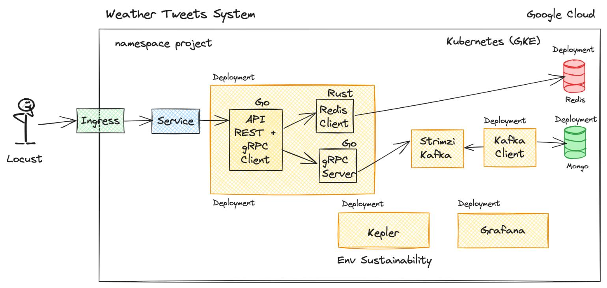
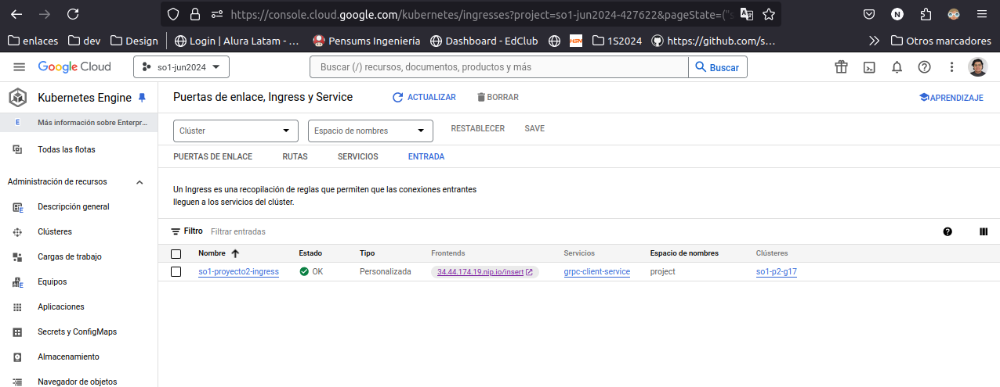
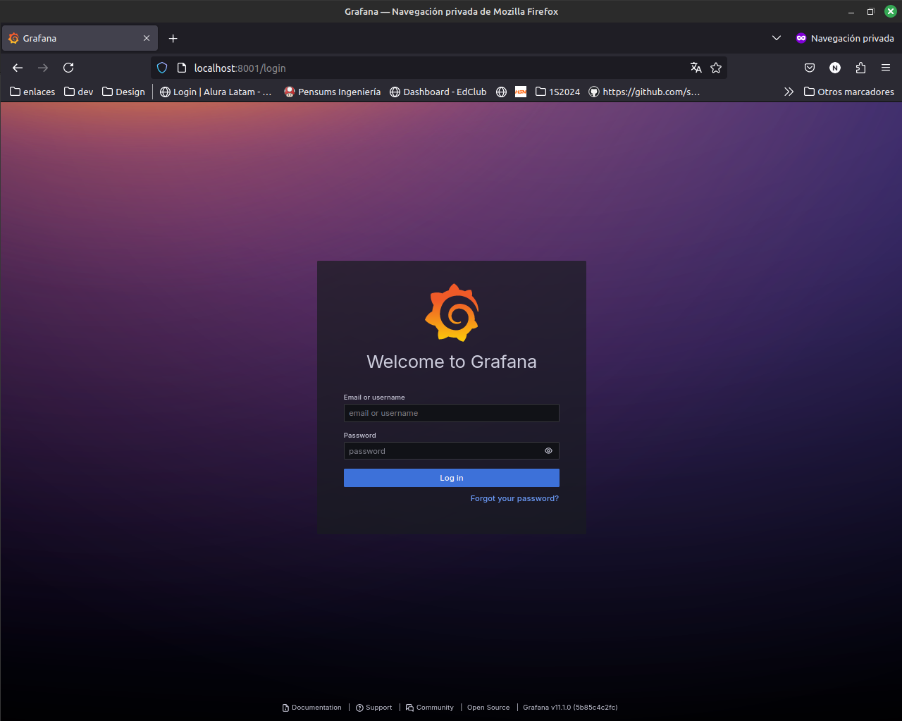
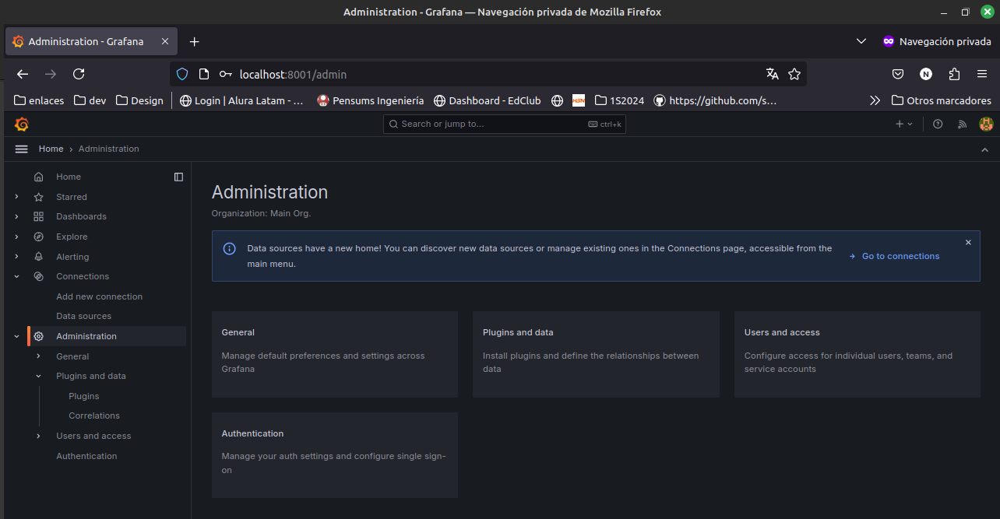
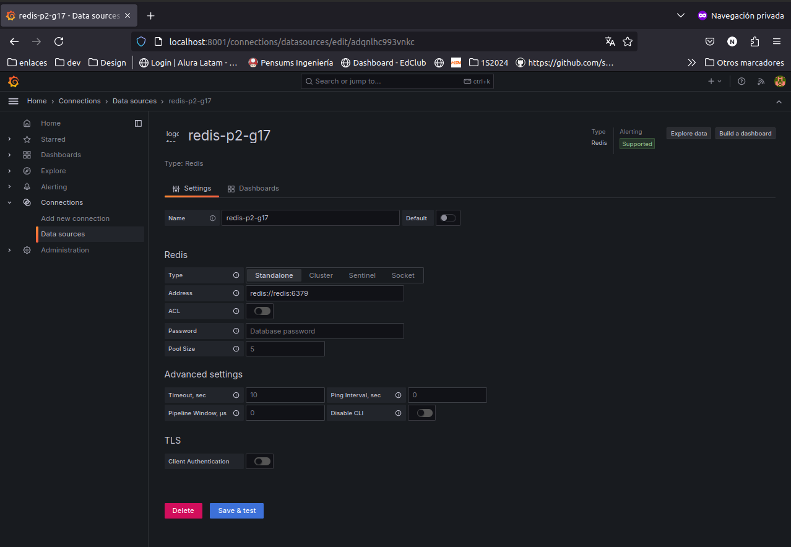
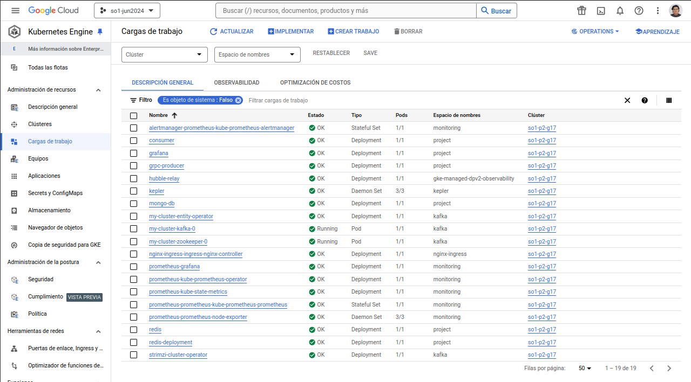
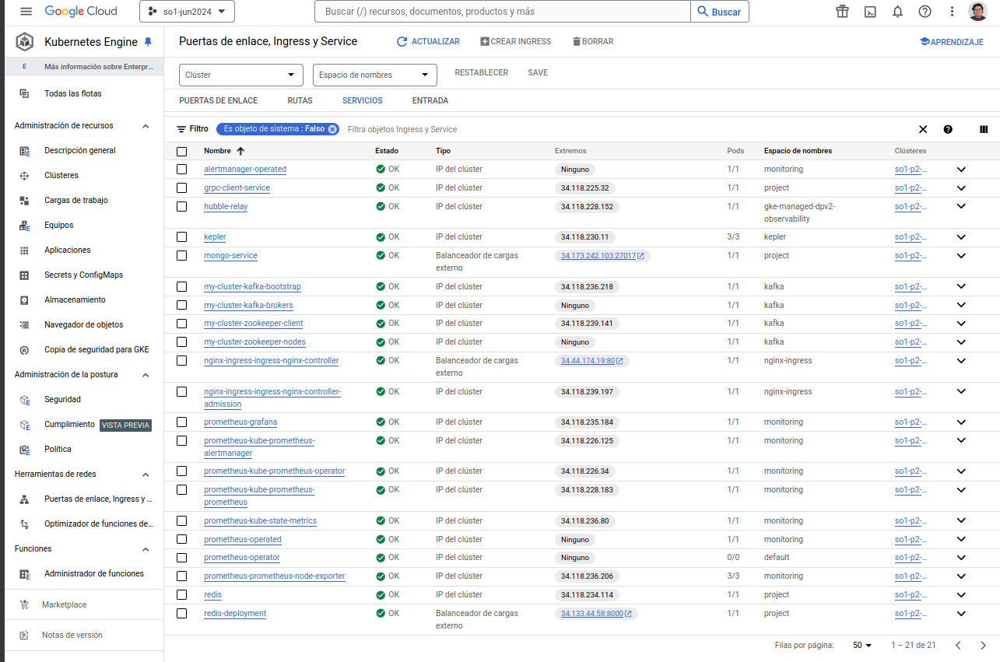

# MANUAL TÉCNICO - PROYECTO 2

## **INDICE**
  - [**RESPONSABLES**](#responsables)
  - [**DESCRIPCION**](#descripcion)
  - [**ARQUITECTURA**](#arquitectura)
  - [**PREPARACIÓN**](#preparación)
  - [**LOCUS**](#locus)
  - [**INGRESS**](#ingress)
  - [**GRPC**](#grpc)
  - [**CONSUMER**](#consumer)
  - [**KAFKA**](#kafka)
  - [**RUST**](#rust)
  - [**KEPLER**](#kepler)
  - [**GRAFANA**](#grafana)
  - [**DOCKER**](#docker)
  - [**YAML**](#yaml)
  - [**DEPLOYMENT**](#deployment)
  - [**REFERENCIAS**](#referencias)

___
## **RESPONSABLES**

|No.| Nombre | Carnet |
|:-:| ------ | ------ |
|1| Geremías López | 200313184 |
|2| Nery Jiménez| 201700381 |

___
## **DESCRIPCION**
Arquitectura desplegada en kubernetes para el monitoreo de tweets alrededor del mundo con el topic del clima en su país de residencia. La arquitectura es apta para ser escalable, utiliza dos apis, una en los lenguajes `gRPC + Go` que se conecta al sistema de `Kafka` para poder almacenar logs de los tweets realizados en una base de datos en `mongoDB`. La segunda api trabajará con los lenguajes `gRPC + Rust` y se conectará a una base de datos en `Redis`, la cual nos permitirá llevar seguimiento a las estadísticas obtenidas desplegadas en el sistema de `Grafana`. También podremos monitorear las emiciones de `CO2` de nuestro clúster utilizando el framework de `Kepler`. Para la simulación de tráfico de los tweets y los internautas alrededor del mundo, se utilizará `Locus` para generar tráfico en el `Ingress` de nuestro sistema desplegado.

___
## **ARQUITECTURA**
Arquitectura del sistema `Weather Tweets System` 


___
## **PREPARACIÓN**
Para poder desarrollar el proyecto, es indispensable tener una cuenta en [Google Cloud](https://cloud.google.com/), ya que utilizaremos clústers de kubernetes.

El proyecto ha sido desarrollado en un sistema operativo `Linux`, por lo que se recomienda utilizar Ubuntu para tener compatibilidad de las tecnologías implementadas.

### Instalación de herramientas
Debemos preparar el entorno de trabajo instalando las siguientes tecnologías:

* [gCloud CLI](https://cloud.google.com/sdk/docs/install?hl=es-419)

### Creación de Clúster
Dado que necesitaremos bastantes recursos para el despliegue de los servicios, el clúster debe contar con las siguientes características:
* 2 Nodos
* Tipo de máquiona N1-Standard-2
* Zona us-central1-a

Se puede crear diréctamente en cloud.google.com o con el siguiente comando:

```
    gcloud container clusters create nombre-proyecto --num-nodes 2 --machine-type n1-standard-2 --zona us-central1-a
```

### Instalar Helm
Helm es un sistema de manejo de paquetes con los que instalaremos algunas herramientas dentro de nuestro clúster. Las instrucciones de instalación las podemos seguir desde su sitio oficial:

* [Instalar Helm](https://helm.sh/docs/intro/install/)
___
## **LOCUS**
Se utilizó Locus para enviar tráfico concurrente a nuestro servidor, su configuración la podemos ver en el siguiente segménto de código

### Class Reader
Esta clase busca un archivo json en nuestro directorio raíz para iterar la data que consumirá nuestro servicio

``` python

    class Reader():
    def __init__(self) -> None:
        self.array = []

    def pickRandom(self):
        length = len(self.array)

        if ( length > 0 ):
            random_index = randrange(0, length - 1) if length > 1 else 0
            return self.array.pop(random_index)
        else:
            print(">> Reader: No encontramos valores en el archivo")
            return None

    def load(self):
        print(">> Reader: Iniciando lectura del archivo de datos")
        try:
            with open("data.json", "r") as data_file:
                self.array = json.loads(data_file.read())
        except Exception as error:
            print(f'>> Reader: Error en {error}')
```

### Class MessageTraffic
Es la encargada de enviar el tráfico hacia nuestro sistema desplegado

``` python

   class MessageTraffic(HttpUser):
    wait_time = between(0.1, 0.9)
    reader = Reader()
    reader.load()

    def on_start(self):
        print(">> MessageTraffic: Inicio de envío de tráfico")

    @task
    def PostMessage(self):
        random_data = self.reader.pickRandom()

        if ( random_data is not None ):
            data_to_send = json.dumps(random_data)
            printDebug(data_to_send)
            self.client.post("/", json=random_data)
        else:
            print(">> MessageTraffic: Envío finalizado")
            self.stop(True)

    @task
    def GetMessage(self):
        self.client.get("/")
```

### Ejecución de Locus en nuestra terminal
Para poder utilizar el servicio, debemos ingresar los siguientes comandos, donde nos aseguramos de tener creado un ambiente virtual para el manejo de tráfico

```bash
sudo apt install python3-locust

# Creando entorno virtual
pip3 install virtualenv

virtualenv env1
source env1/bin/activate

# Ejecutando
locust -f traffic.py

```

___
## **INGRESS**
Este servicio se debe desplegar en nuestro clúster, primero debemos realizar algunas instalaciones

```bash

kubectl create ns nginx-ingress

helm repo add ingress-nginx https://kubernetes.github.io/ingress-nginx
helm repo update 
helm install nginx-ingress ingress-nginx/ingress-nginx -n nginx-ingress
```

Luego obtenemos la ip del Load Balancer External con el siguiente comando

``` bash
kubectl get services -n nginx-ingress //Load Balancer
```

y estamos listos para desplegar nuestros `*.yaml | *.yml`

### Ingress desplegado en k8s

___
## **GRPC**
Es un framework RPC de alto rendimiento que puede ejecutarse en
cualquier entorno. Tendremos dos servicios en este segmento, `gRPC_client` y `gRPC_server` 

### gRPC_Client
Acá tenemos las funciones que nos permitirán enviar los datos entre el cliente y el servidor, así como las inserciones hacia las bases de datos

``` go
func sendToRust(data *Data) {
	jsonData, err := json.Marshal(data)
	if err != nil {
		log.Fatal(err)
	}

	res, err := http.Post("http://redis-deployment:8000/set", "application/json", bytes.NewBuffer(jsonData))
	if err != nil {
		log.Fatal(err)
	}
	defer func(Body io.ReadCloser) {
		err := Body.Close()
		if err != nil {
			log.Fatal(err)
		}
	}(res.Body)

	if res.StatusCode != http.StatusOK {
		log.Fatalf("status code error: %d %s", res.StatusCode, res.Status)
	}
}

func sendData(c *fiber.Ctx) error {
	/* API REST */
	var data map[string]string
	e := c.BodyParser(&data)
	if e != nil {
		return e
	}

	tweet := Data{
		Texto: data["texto"],
		Pais:  data["pais"],
	}

	go sendGrpcServer(tweet)
	go sendToRust(&tweet)

	return nil
}

func sendGrpcServer(tweet Data) {
	/* GRPC Client */
	conn, err := grpc.Dial("localhost:3001", grpc.WithTransportCredentials(insecure.NewCredentials()),
		grpc.WithBlock())
	if err != nil {
		log.Fatalf("did not connect: %v", err)
	}

	cl := pb.NewGetInfoClient(conn)
	defer func(conn *grpc.ClientConn) {
		err := conn.Close()
		if err != nil {
			log.Fatalf("could not close connection: %v", err)
		}
	}(conn)

	ret, err := cl.ReturnInfo(ctx, &pb.RequestId{
		Texto: tweet.Texto,
		Pais:  tweet.Pais,
	})
	if err != nil {
		log.Fatal(err)
	} else {
		fmt.Println("Respuesta del servidor ", ret)
	}
}
```

### gRPC_Server
Es el encargado de recibir el tweet por parte del cliente y prepararlo para que `Kafka` realice las inserciiones a la base de datos de mongo.

``` go
func (s *server) ReturnInfo(ctx context.Context, in *pb.RequestId) (*pb.ReplyInfo, error) {
	tweet := model.Data{
		Texto: in.GetTexto(),
		Pais:  in.GetPais(),
	}

	fmt.Println(tweet)

	kafka.Produce(tweet)

	return &pb.ReplyInfo{Info: "Hola cliente, recibí el tweet"}, nil
}

func main() {
	listen, err := net.Listen("tcp", ":3001")
	if err != nil {
		panic(err)
	}
	s := grpc.NewServer()
	pb.RegisterGetInfoServer(s, &server{})

	if err := s.Serve(listen); err != nil {
		panic(err)
	}
}
```

___
## **CONSUMER**
Este servicio viene desde el gRPC_Server, y será el encargado de insertar los datos a mongoDB

```GO
func processEvent(event []byte) {
	var data model.Data
	err := json.Unmarshal(event, &data)
	if err != nil {
		log.Fatal(err)
	}

	// Agregar la fecha y hora actual
	data.Timestamp = time.Now()

	if err := Database.Connect(); err != nil {
		log.Fatal("Error en", err)
	}

	collection := Instance.Mg.Db.Collection("register")
	_, err = collection.InsertOne(context.TODO(), data)
	if err != nil {
		log.Fatal(err)
	}

	// fmt.Println(data)
}

func main() {
	topic := "mytopic"
	r := kafka.NewReader(kafka.ReaderConfig{
		Brokers:     []string{"my-cluster-kafka-0.my-cluster-kafka-brokers.kafka.svc:9092"}, // my-cluster-kafka-0.my-cluster-kafka-brokers.kafka.svc
		Topic:       topic,
		Partition:   0,
		MinBytes:    10e3,
		MaxBytes:    10e6,
		StartOffset: kafka.LastOffset,
		GroupID:     uuid.New().String(),
	})

	for {
		m, err := r.ReadMessage(context.Background())
		if err != nil {
			log.Printf("Error reading message: %v", err)
		}
		fmt.Printf("Message at offset %d: %s = %s\n", m.Offset, string(m.Key), string(m.Value))

		processEvent(m.Value)

		err = r.CommitMessages(context.Background(), m)
		if err != nil {
			log.Printf("Error committing message: %v", err)
		}
	}
}
```

Hace un paso por kafka para encolar las solicitudes y no saturar al servidor

___
## **Kafka**
Es el encargado de manejar las solicitudes entre el servidor y la base de datos, generando una cola para no saturar ningún servicio. Este será desplegado a tráves de `Strimzi`, un operador de kubernetes que simplifica la instalación

### Instalación de Strimzi
Para la instalación, se crea un namespace para el servicio y se optiene la imagen del servicio
```bash
kubectl create namespace kafka
kubectl create -f 'https://strimzi.io/install/latest?namespace=kafka' -n kafka
kubectl get pod -n kafka --watch
```
Ya con el servicio listo, podemos instalar Kafka con los siguientes comandos:

```bash
kubectl apply -f https://strimzi.io/examples/latest/kafka/kafka-persistent-single.yaml -n kafka

kubectl wait kafka/my-cluster --for=condition=Ready --timeout=300s -n kafka
or

watch kubectl get pod -n kafka
```

Ahora el server puede utilizar Kafka con este segmento de código
```go
func Produce(value model.Data) {
	topic := "mytopic"
	partition := 0

	conn, err := kafka.DialLeader(context.Background(), "tcp", "my-cluster-kafka-0.my-cluster-kafka-brokers.kafka.svc:9092", topic, partition) // my-cluster-kafka-0.my-cluster-kafka-brokers.kafka.svc
	if err != nil {
		panic(err)
	}

	valueBytes, err := json.Marshal(&value)
	if err != nil {
		panic(err)
	}
	err = conn.SetWriteDeadline(time.Now().Add(10 * time.Second))
	if err != nil {
		return
	}
	_, err = conn.WriteMessages(
		kafka.Message{
			Value: valueBytes,
		})

	if err != nil {
		panic(err)
	}

	if err := conn.Close(); err != nil {
		panic(err)
	}

	log.Printf("Produced message to topic %s at partition %d", topic, partition)
}
```
___
## **RUST**
Será nuestra segunda API para el almacenamiento de los tweets a una base de datos en redis, se debe crear el siguiente archivo: `main.rs` 

```rust
use rocket::serde::json::Json;
use rocket::serde::{Deserialize, Serialize};
use redis::Commands;

#[derive(Deserialize, Serialize)]
struct Data {
    Pais: String,
    Texto: String
}

#[post("/set", format = "json", data = "<data>")]
async fn set_data(data: Json<Data>) -> Result<&'static str, &'static str> {
    // Crear cliente de redis
    let client = redis::Client::open("redis://redis:6379/")
        .map_err(|_| "Failed to create Redis client")?;

    // Conexion a redis
    let mut con = client.get_connection()
        .map_err(|_| "Failed to connect to Redis")?;

    // Insertar hash en redis
    let _: () = con.hincr(&data.Pais, &data.Texto, 1)
        .map_err(|_| "Failed to set data in Redis")?;
    Ok("Data set")
}

#[launch]
fn rocket() -> _ {
    rocket::build().mount("/", routes![set_data])
}
```

El cual compilaremos con la ayuda del archivo `Cargo.toml`

```bash
[package]
name = "redis-rust"
version = "0.1.0"
edition = "2021"

[dependencies]
rocket = { version = "0.5.0-rc.2", features = ["json"] }
redis = "0.23.0"
serde = { version = "1.0", features = ["derive"] }
serde_json = "1.0"
```
y los siguientes comandos

```bash
cargo build
```

### Exponiendo Deployment
Ya que tenemos preparado el archivo de rust en su respectivo docker image, procedemos a hacer el deployment en k8s

```bash
kubectl create deployment redis-deployment --image=user/image -n project

# Exponiendo el puerto
kubectl expose deployment redis-deployment --type=LoadBalancer --port 8000 -n project
```

___
## **KEPLER**
Esta herramienta nos permitirá monitorear la generación de CO2 de nuestros servicios en la nube, para instalarlo debemos preparar nuestra área de trabajo con el siguiente [enlace](https://sustainable-computing.io/installation/kepler-helm/)

### Instalación
Una vez hechos los primeros pasos, ahora ingresamos los siguientes comandos para la instalación

```bash
kubectl get pods -n monitoring
kubectl get secrets -n monitorin

# Obtenemos credenciales de grafana
kubectl get secrets prometheus-grafana -n monitoring -o yaml

# Desebcriptamos los valores
echo "cHJvbS1vcGVyYXRvcg==" | base64 --decode
prom-operator

echo "YWRtaW4=" | base64 --decode
admin

kubectl get svc -n monitoring

# Exponiendo puerto para despliegue
kubectl port-forward svc/prometheus-grafana 8001:80 -n monitoring
```

___
## **GRAFANA**
Este es el dashboard donde estaremos mostrando el consumo de energía de nuestro clúster y los datos generados por los tweets alrededor del mundo, para su implementación basta con ejecutar el archivo .yaml en la terminal

```bash
kubectl apply -f grafana.yaml

# Exponiendo el puerto
kubectl port-forward --address 0.0.0.0 deploy/grafana 3000:3000 -n project
```

El servicio se ve de esta manera:


Ingresamos las credenciales, y nos vamos al apartado de plugins para instalar redis


Y por último generamos la conexión
 

___
## **DOCKER**
Es importante tener una imagen de docker por servicio, ya que de esa forma se desplegará en nuestro clúster de kubernetes. En general, este es el aspecto de los `Dockerfile`

```dockerfile
# Etapa de construccion
FROM rust:latest AS builder
WORKDIR /app
COPY . .
RUN cargo build --release

# Etapa de ejecucion
FROM ubuntu:22.04
WORKDIR /app

RUN mkdir -p /app

COPY --from=builder /app/target/release/redis-rust /app/redis-rust
COPY Rocket.toml /app/Rocket.toml

RUN apt-get update && apt-get install -y libssl-dev ca-certificates && apt-get clean

CMD ["./redis-rust"]
```

Se crea la imagen y posteriormente se sube a `Dockerhub`
```bash
# Creando imagen de grpc
docker build -t image .

# Agregandole tag para hacer push
docker push image
```

___
## **YAML**
Una vez que tenemos listas nuestras images de docker en el hub, podemos desplegar los *.yaml en kubernetes

### Estructura de un archivo yaml
```yaml
apiVersion: apps/v1
kind: Deployment
metadata:
  name: redis
  namespace: project
spec:
  replicas: 1
  selector:
    matchLabels:
      app: redis
  template:
    metadata:
      labels:
        app: redis
    spec:
      containers:
      - name: redis
        image: redis:latest
        ports:
        - containerPort: 6379
---
apiVersion: v1
kind: Service
metadata:
  name: redis
  namespace: project
spec:
  ports:
  - port: 6379
    targetPort: 6379
  selector:
    app: redis
```

### Despliegue en kubernetes
```bash
kubectl apply -f redis.yaml

kubectl get pods -n project
```
___
## **DEPLOYMENT**
Después de haber ejecutado los comandos para el despliegue en k8s, podremos ver en nuestro clúster los servicios que se encuentran desplegados.

### Pods generados


### Services generados

___
## **REFERENCIAS**
Este proyecto ha sido realizado con las referencias de los repositorios del ingeniero Sergio Méndez y el auxiliar Daniel Velásquez.

* [Sergio Méndez](https://github.com/sergioarmgpl/operating-systems-usac-course)
* [Daniel Velásquez](https://github.com/DannyLaine158/SO1-JUN2024/tree/main)